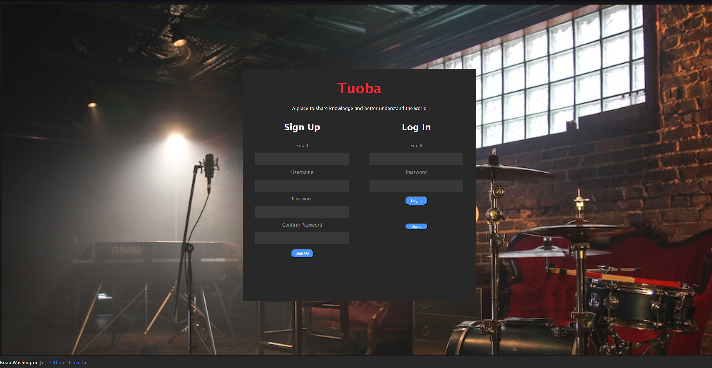
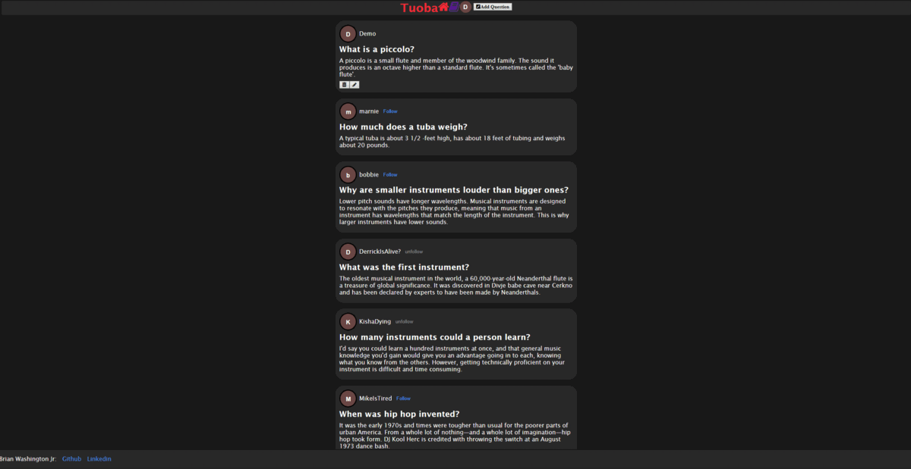
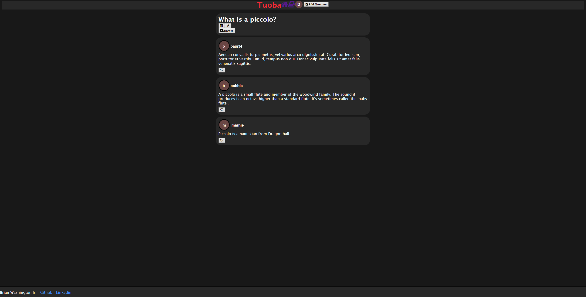

# TUOBA

<link rel="stylesheet" href="https://cdn.jsdelivr.net/gh/devicons/devicon@latest/devicon.min.css">
Tuoba is a soft clone of Quora. Here you can ask any music related question and get answers from fellow users. You can also answer other user's questions.

 

Check out [Tuoba](https://tuoba.onrender.com)!

## Index

[MVP Feature List](https://github.com/zipzopboppitybop/Tuoba/wiki/Features) | [Database Schema](https://github.com/zipzopboppitybop/Tuoba/wiki/Database-Schema) |
[User Stories](https://github.com/zipzopboppitybop/Tuoba/wiki/User-Stories) | [WireFrame](https://github.com/zipzopboppitybop/Tuoba/wiki/Wireframe)

## Technologies Used

## Splash Page

### Not Logged In

### Logged In

### Single Question And Answers

## Getting started
1. Clone this repository:

   `
   https://github.com/zipzopboppitybop/Tuoba
   `
2. Install denpendencies into the root of the repository with the following:

   * `pipenv install -r requirements.txt`

3. Create a **.env** file using the **.envexample** provided

4. Set up your database with information from your .env and then run the following to create your database, migrate, and seed:

   * `pipenv shell`
   * `flask db upgrade`
   * `flask seed all

5. Start the app for backend using:

   * `flask run`

6. Install denpendencies into the frontend repository with the following:

   * `npm install`

7. Start the app for frontend using:

   * `npm start`

8. Now you can use the Demo User or Create an account

***

# Features

## Questions
* Logged in Users can ask a Queston
* Users can read/view other Question
* Logged in Users can update their Question
* Logged in Users can delete their Question

## Answers
* Logged in Users can answer Questions
* Users can read/view all of the Answers on a Question
* Logged in Users can delete their Answers on a Question
* Logged in Users can update their Answers on a Question

## Follows
Logged-in Users can
* Follow other users
* Unfollow other users

## Likes
Logged-in Users can
* Like Answers on Questions
* UnLike Answers on Questions

## Future Features

### Search Feature
* Users can search for questions

### User Profile
* Users can update and delete their profile

## My Links

([GitHub](https://github.com/zipzopboppitybop) | [LinkedIn](https://www.linkedin.com/in/brian-washington-668129244/))
